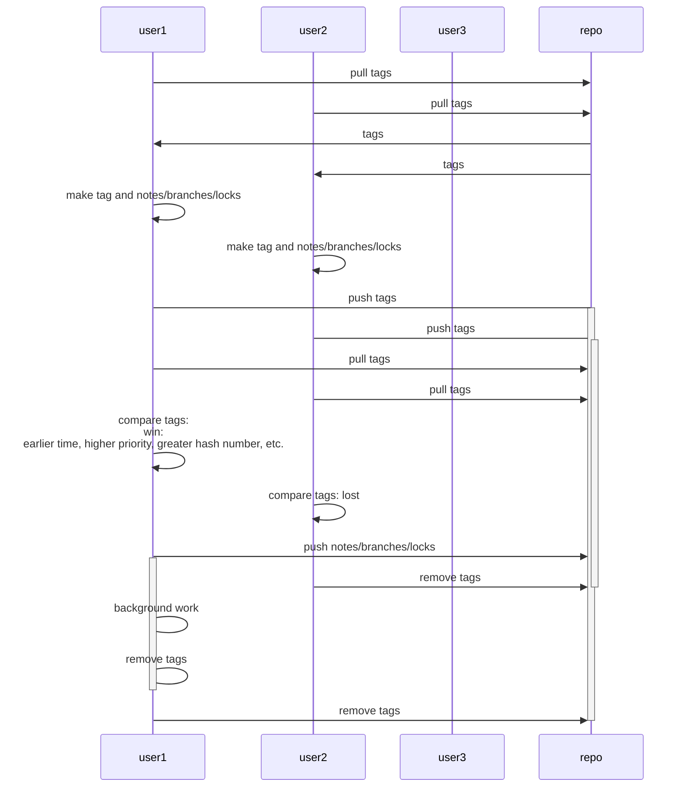

# Git-based locking

## Use-cases

- distributed git-only based CI
- terraform backend

## Usage

Copy gitlock to your $PATH (for example to /usr/local/bin/git-lock) and run it as git subcommand.

You should be able to push tags to the origin.

Run `git lock exec <command> <args...>`

For example:

```
wget https://raw.githubusercontent.com/eliastor/gitlock/master/gitlock
sudo mv gitlock /usr/local/bin/git-lock
sudo chmod +x /usr/local/bin/git-lock
git-lock exec uname -a
```

In example above `uname -a` will be executed only after successful lock of repo in origin.
After execution gitlock will release the lock from origin.

To list current locks:

```
git lock list
```

To get info about lock:

```
git lock show <lock name>
```

To force release of the lock (DANGEROUS).
It must be used only when you are absolutely sure that particular lock is stuck.

```
git lock force-unlock <lock name>
```

## Flow


