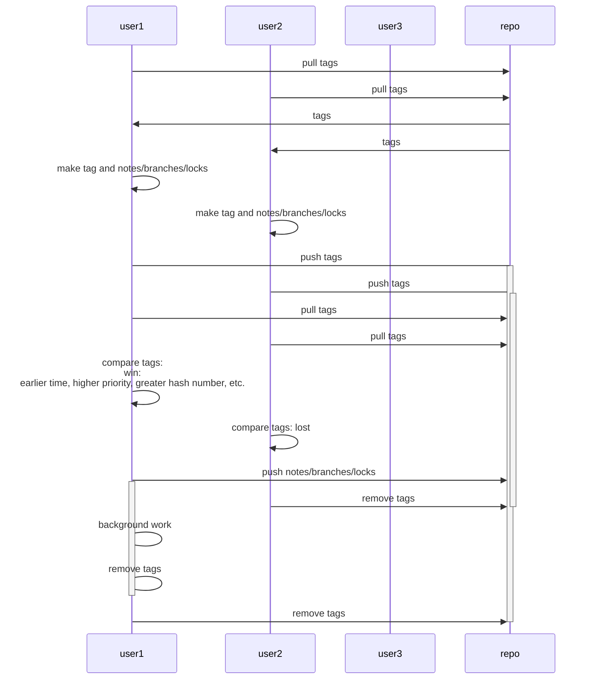

# Git-based locking

## Use-cases

- distributed git-only based CI
- terraform backend

## Usage

Copy gitlock.sh to your repository with configured origin repo.

You should be able to push tags to the origin.

Run `./gitlock.sh <command> <args...>`

For example:

```
wget https://raw.githubusercontent.com/eliastor/gitlock/master/gitlock.sh
chmod +x gitlock.sh
./gitlock.sh uname -a
```

In example above `uname -a` will be executed only after successful lock of repo in origin.
After execution gitlock.sh will release the lock from origin.

## Flow


